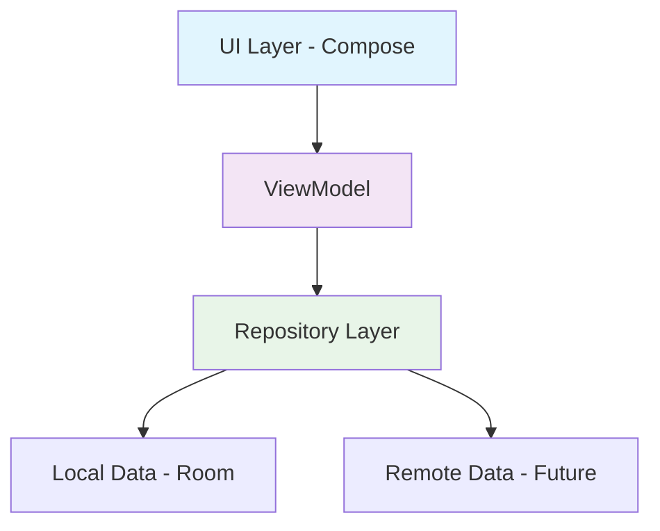

# 📱 PageBook Android

**Нативная Android-реализация** универсального органайзера с акцентом на плавность работы и Material Design! 🚀

[](https://kotlinlang.org)
[](https://developer.android.com/jetpack/compose)
[](LICENSE)

## 🌟 О проекте

PageBook - это нативное Android-приложение для работы со справочными материалами, заметками, задачами и календарем. Часть кроссплатформенного проекта PageBook, разрабатываемого нативно для обеих платформ.

> 📖 **iOS версия**: [PageBook iOS](https://github.com/MaxGog/PageBook-ios)

## ✨ Основные возможности

### 📝 Умные заметки
- Создание и редактирование с поддержкой форматирования 🎨
- Организация по категориям и тегам 🏷️
- Быстрый поиск и фильтрация

### ✅ Менеджер задач
- To-do листы с приоритетами
- Напоминания и дедлайны
- Прогресс выполнения

### 🗓️ Календарь и планирование
- Ежедневное и недельное планирование
- Интеграция задач и событий
- Гибкие настройки отображения

## 🛠 Технологический стек

- **💚 100% Kotlin** - современный и выразительный код
- **🎨 Jetpack Compose** - декларативный UI будущего
- **💾 Room Database** - надежное локальное хранение
- **🔄 Coroutines & Flow** - реактивное программирование
- **🗂️ Hilt** - dependency injection
- **📐 Material Design 3** - современные UI компоненты

## 🏗 Архитектура



### Чистая архитектура с MVVM
- **UI Layer**: Jetpack Compose + ViewModel
- **Domain Layer**: Use Cases & Business Logic  
- **Data Layer**: Repository pattern with Room

## 🚀 Быстрый старт

### Предварительные требования
- Android Studio Hedgehog или новее
- Android SDK 34 (Android 14)
- Kotlin 1.9.0+

### Установка и запуск

1. **Клонируйте репозиторий**
   ```bash
   git clone https://github.com/MaxGog/PageBook-android.git
   cd PageBook-android
   ```

2. **Откройте в Android Studio**
   - File → Open → Выберите папку проекта
   - Дождитесь завершения сборки зависимостей

3. **Запустите приложение**
   - Подключите Android устройство или запустите эмулятор
   - Нажмите ▶️ Run или `Ctrl + R`

## 📁 Структура проекта

```
app/
├── src/main/
│   ├── java/com/pagebook/
│   │   ├── ui/              # Compose UI компоненты
│   │   │   ├── screens/     # Экраны приложения
│   │   │   ├── components/  # Переиспользуемые UI компоненты
│   │   │   └── theme/       # Тема и стили Material Design
│   │   ├── repositories/    # Репозитории
│   │   ├── database/        # Room database и DAO
│   │   ├── models/          # Data модели
│   │   ├── models/          # Domain модели
│   │   └── utils/           # Утилиты и extensions
│   └── res/                 # Ресурсы
│       ├── drawable/        # Иконки и изображения
│       └── values/          # Colors, strings, themes
```

## 🧩 Основные модули

| Модуль | Описание | Технологии |
|--------|----------|------------|
| **notes** | Управление заметками 📝 | Compose, Room, ViewModel |
| **tasks** | To-do листы и задачи ✅ | Compose, StateFlow, Room |
| **calendar** | Планирование и события 🗓️ | Compose, Date Picker |

## 🛠 Разработка

### Сборка проекта
```bash
./gradlew assembleDebug
```

### Тестирование
```bash
./gradlew test
```

### Анализ кода
```bash
./gradlew ktlintCheck
```

## 🤝 Участие в разработке

Мы рады контрибьюторам! Вот как вы можете помочь:

### 🐛 Сообщение о багах
- Используйте [Issues](https://github.com/MaxGog/PageBook-android/issues)
- Опишите шаги для воспроизведения
- Укажите версию ОС и устройства

### 💡 Предложение улучшений
- Откройте Issue с меткой `enhancement`
- Опишите проблему и предлагаемое решение

### 🔧 Pull Requests
1. Форкните репозиторий
2. Создайте feature branch (`git checkout -b feature/amazing-feature`)
3. Сделайте коммит изменений (`git commit -m 'Add amazing feature'`)
4. Запушьте branch (`git push origin feature/amazing-feature`)
5. Откройте Pull Request

### 🏷️ Good First Issues
Начните с задач, помеченных `good first issue` - они идеальны для новичков!

## 🎯 Планы развития

- [ ] **Синхронизация с облаком** ☁️
- [ ] **Темная тема** 🌙  
- [ ] **Виджеты для главного экрана** 🏠
- [ ] **Резервное копирование** 💾
- [ ] **Голосовые заметки** 🎤

## 📄 Лицензия

Этот проект распространяется под лицензией MIT. Подробнее см. в файле [LICENSE](LICENSE).

## 👨‍💻 Автор

**MaxGog**
- GitHub: [@MaxGog](https://github.com/MaxGog)

## 💬 Обратная связь

Есть вопросы или предложения? Не стесняйтесь:
- Создать [Issue](https://github.com/MaxGog/PageBook-android/issues)
- Написать в Discussions

---

**⭐ Не забудьте поставить звезду репозиторию, если проект вам понравился!**
