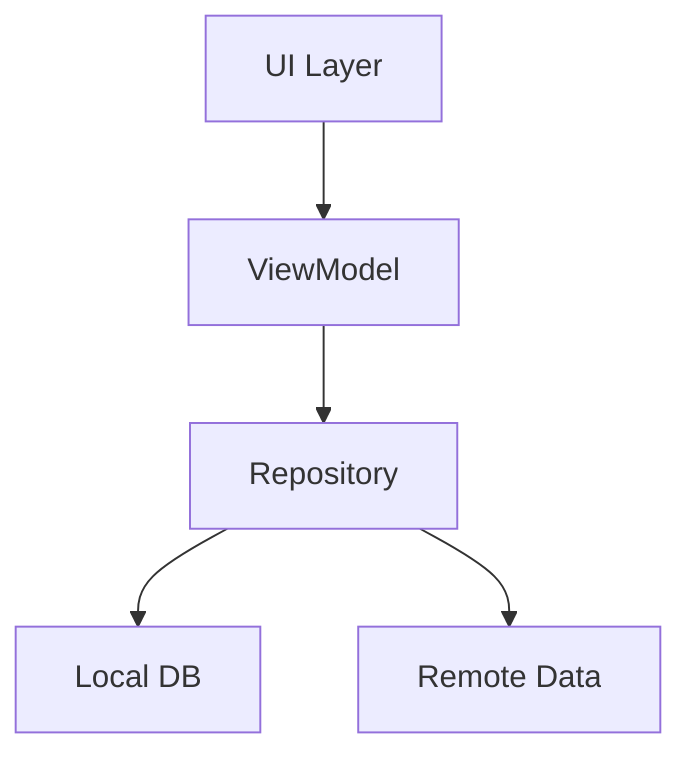

# 📱 PageBook Android

**Нативная Android-реализация** нашего универсального органайзера с акцентом на плавность работы и Material Design! 🚀

## 🛠 Технологический стек
- **100% Kotlin** - современный и выразительный код
- **Jetpack Compose** - декларативный UI будущего ✨
- **Room Database** - надежное локальное хранение
- **Hilt** - удобная dependency injection
- **Coroutines Flow** - асинхронность без боли

## 🏗 Архитектура


## 🏃‍♂️ Быстрый старт
1. Клонируйте репозиторий
2. Откройте в Android Studio
3. Нажмите "Run" ▶️

```bash
git clone https://github.com/maxgog/pagebook/pagebook-android.git
```

## 🧩 Основные компоненты
| Модуль       | Описание                          |
|--------------|-----------------------------------|
| `ui/screens/notesscreen`   | Вся логика работы с заметками 📝 |
| `ui/screens/tasksscreen`   | Управление задачами ✅           |
| `ui/screens/calendarscreen`| Календарь и планирование 🗓️     |

## 🤝 Как помочь проекту
- Тестируйте на разных устройствах 📱
- Оптимизируйте производительность ⚡
- Предлагайте улучшения UI/UX 🎮

> 💡 Совет: Начните с issues с меткой `good first issue`!
